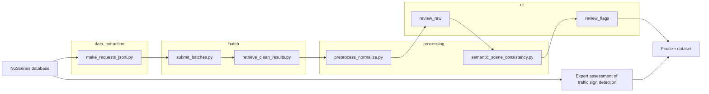

# VLM ODD Pipeline

End-to-end pipeline to generate, batch, clean, and validate **Operational Design Domain (ODD)** annotations from nuScenes using **Vision-Language Models (VLMs)**.

---

## Pipeline at a glance

> Mermaid diagram (renders on GitHub). Order: Preprocessing -> GUI #1 -> Semantic checks -> GUI #2. Extra link: NuScenes -> Expert assessment.


**GUIs are required.**
- GUI #1: verify the first frame per scene to anchor temporal consistency.
- GUI #2: review and relabel all items flagged by automatic checks.

---

## Quickstart

**0) Download nuScenes (official website)**  
Get the trainval split and extract locally. You will pass `--dataroot` to scripts below.

**1) Build requests JSONL**
```bash
python data_extraction/make_requests_jsonl.py   --dataroot /path/to/nuscenes   --prompt configs/prompts/prompt.txt   --output original_requests.jsonl
```

**2) Submit batches iteratively (generic paths)**
```bash
python batch/submit_batches.py   --base-dir <out_dir_for_iterations>   --original-requests original_requests.jsonl
```

**3) Monitor batches (generic paths)**
```bash
python batch/monitor_batches.py   --ids <path_to_submitted_batch_ids.txt>   --stop-when-done
```

**4) Retrieve and clean results**
```bash
# Single IDs file:
python batch/retrieve_clean_results.py   --ids <path_to_submitted_batch_ids.txt>   --combined <combined_results.jsonl>   --cleaned <corrected_results.json>

# Or collect across multiple iterations:
python batch/collect_iteration_results.py   --base-dir <out_dir_for_iterations>
```

**5) GUI #1 — Manual verification of first sample (REQUIRED)**
```bash
cd ui/review_raw
pip install -r requirements.txt
streamlit run app.py --   --input <corrected_results.json>   --out <raw_overrides.json>
```

**6) Automatic preprocessing and normalization**
```bash
python processing/preprocess_normalize.py   --input <annotations.csv>   --output <cleaned_annotations.csv>   --report <checks_report.json>
```

**7) Semantic checks (scene coherence)**
```bash
python processing/semantic_scene_consistency.py   --input <cleaned_annotations.csv>   --output <with_semantic_flags.csv>   --report <semantic_flags_report.json>   --scene-col Scene
```

**8) GUI #2 — Manual review of flagged items (REQUIRED)**
```bash
cd ui/review_flags
pip install -r requirements.txt
streamlit run app.py --   --input <with_semantic_flags.csv>   --out <flag_overrides.csv>
```

**9) Finalize dataset**
- Apply overrides from both GUIs to produce the final consistent dataset.

---

## Repository structure

```
.
├─ README.md
├─ requirements.txt
│
├─ configs/
│  └─ prompts/
│     └─ prompt.txt
│
├─ data_extraction/
│  ├─ README.md
│  └─ make_requests_jsonl.py
│
├─ batch/
│  ├─ README.md
│  ├─ collect_iteration_results.py
│  ├─ monitor_batches.py
│  ├─ retrieve_clean_results.py
│  ├─ submit_batches.py
│  └─ docs/
│     ├─ COLLECT.md
│     ├─ MONITORING.md
│     └─ RETRIEVE.md
│
├─ processing/
│  ├─ README.md
│  ├─ preprocess_normalize.py
│  └─ semantic_scene_consistency.py
│
├─ ui/
│  ├─ review_raw/
│  │  ├─ README.md
│  │  ├─ app.py
│  │  ├─ config.json
│  │  ├─ requirements.txt
│  │  ├─ Validation Guide.pdf
│  │  └─ utils.py
│  └─ review_flags/
│     ├─ README.md
│     ├─ app.py
│     ├─ config.json
│     ├─ requirements.txt
│     ├─ Validation Guide.pdf
│     └─ utils.py
│
└─ examples/
   └─ original_requests.example.jsonl
```

---

## Methodology

Our approach follows a structured pipeline for processing nuScenes images and metadata with a Vision-Language Model (VLM).

### Data Preprocessing
- Extract images and metadata from the nuScenes database.
- Use three images (front, front-left, front-right) together with a text prompt.

### Processing with Vision-Language Model (VLM)
- Feed the selected images and prompt into the VLM (GPT-4o).
- GPT-4o is chosen for strong multimodal reasoning, integrating visual inputs with natural-language context to produce accurate, semantically rich descriptions useful for ODD construction.

### Validation Steps
To deliver consistent, high-quality scene annotations we combine automatic correction with manual verification:

- **Automatic preprocessing and normalization**: applied to all frame-level annotations to improve logical and temporal consistency by (i) normalising binary fields to remove contradictory/unclear answers, (ii) standardising uncertain or partial expressions, (iii) consolidating categorical values, and (iv) explicitly marking rare/structurally absent features as negative.
- **Manual verification of first sample (required)**: for each scene, the first frame is manually checked to confirm ODD parameters (e.g., road type, weather). This sample acts as a temporal anchor for subsequent consistency checks.

#### Automatic annotation correction and consistency checks
After preprocessing and the first manual check, we apply a dedicated automated pipeline with two stages: temporal smoothing and logical validation.

- **Temporal smoothing**: treat each scene as a time sequence for categorical/binary labels (e.g., potholes, lane narrow, street lights). Short isolated spikes are corrected via two hyperparameters n and m: segments with length < n are flipped to match neighbours; segments with n <= length < m are retained but passed to logical validation.
- **Logical validation**: rule-based checks catch semantic/structural issues (per PAS ODD guidance), e.g. temporal anomalies (“immediate entry/exit”), cross-field inconsistencies (divided and undivided cannot both be yes), scene logic rules (roadworks should be supported by temporary signage or line markers), and environmental transitions (clear -> overcast must pass through partly cloudy except brief detours).

Each ODD parameter receives a status such as OK, Sudden lane change, or Illumination inconsistency to drive manual triage and filtering.

- **Second manual review (required)**: all parameters flagged with any status other than OK are reviewed and, if needed, re-labelled to resolve subtle context-dependent cases via human judgement.

### Traffic Sign Validation
Validating traffic-sign annotations is challenging due to country-specific semantics and required temporal consistency.

- **VLM-based evaluation**: front, front-left, front-right images are processed by GPT-4o to produce natural-language descriptions; grouped temporally by sign category (regulatory, warning, information).
- **YOLO-based assistance**: pre-trained YOLO-TS models (TT100K, CCTSDB2021, GTSDB, Generated-TT100K-weather) propose candidate signs (front camera only), used only to assist human labeling.
- **Post-processing and label unification**: candidates are merged per frame with confidence-based NMS (IoU 0.7) and dataset-specific thresholds, then mapped to a unified taxonomy (“Common” label space).
- **Human-in-the-loop verification**: annotators inspect all suggestions, decide presence/type/timing, remove false positives, and enforce temporal consistency; YOLO outputs are assistive, not ground truth.

**Evaluation of VLM traffic-sign detection.** Two-stage evaluation:
1) Category-level accuracy vs. human labels (Regulatory/Warning/Information).
2) Description-level similarity within each category using a standardised vocabulary and fuzzy Jaccard:

$$
J_f(A, B) = \frac{\sum_{a \in A} \max_{b \in B} \mathrm{sim}(a, b)}{|A \cup B|}
$$

where \( \mathrm{sim}(a,b) \) in [0,1] is a normalised string similarity (e.g., token-level fuzzy matching).

---

## License

MIT (see `LICENSE`).
